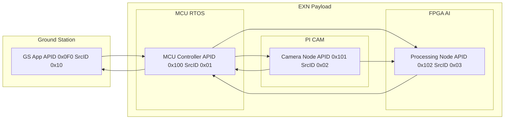

    

# EXN [[ExoSpaceLabs](https://github.com/ExoSpaceLabs)] – Advanced Satellite Telemetry, Recognition & AI 

**EXN** is a modular open-source demonstration payload that combines a **Raspberry Pi**, **STM32 (RTOS)**, and **FPGA** into an integrated Earth Observation system.  
The goal is to showcase onboard image capture, CCSDS packetization, AI inference, and system-level coordination – all within a realistic space payload architecture.

---

## 🌌 Project Overview
EXN demonstrates how different embedded platforms can work together as a cohesive payload:
- **Pi (Camera Node):** Captures images, pre-packets or streams raw data.
- **STM32 RTOS (Control Node):** Supervises the system, handles CCSDS TeleCommands/TeleMetry, performs health checks, and routes control.
- **FPGA (Processing Node):** Performs preprocessing (resize/normalize), inference acceleration, and postprocessing (argmax).
- **CCSDSPack:** Provides CCSDS packet definitions and handling across nodes.

All interfaces (CCSDS, SPI/UART/CAN links, FPGA register maps) are defined in the central **EXN interfaces** specification, ensuring consistency across hardware.

---

## 📂 Repository Structure
This is the **meta-repo** that ties everything together.

- `interfaces/` → Packet interfaces: CCSDSPack `.cfg`, JSON mirrors, and MCU header-only definitions
- `docs/` → architecture docs, diagrams, and roadmaps
- `system/` → integration scripts, manifests, CI/CD workflows
- `submodules/`:
  - [exn-gs](https://github.com/ExoSpaceLabs/exn-gs) (Work started / open)
  - [exn-pi-cam](https://github.com/ExoSpaceLabs/exn-pi-cam) (WIP / locked)
  - [exn-mcu-rtos](https://github.com/ExoSpaceLabs/exn-mcu-rtos) (WIP / locked)
  - [exn-fpga-ai](https://github.com/ExoSpaceLabs/exn-fpga-ai) (WIP / locked)
  - [ccsdspack](https://github.com/ExoSpaceLabs/CCSDSPack)

---

## 🧭 Modular System Graph

Notes:
- GS may request individual HK (Service 3/1) via MCU and may request a System HK aggregation (Service 3/10). MCU bridges/proxies; devices do not depend on GS.
- All APIDs are fixed: GS=0x0F0, MCU=0x100, PI=0x101, FPGA=0x102. Source IDs: MCU=0x01, PI=0x02, FPGA=0x03, GS=0x10.

### ➕ Additional Diagrams

The sequence diagrams have been moved to a dedicated page for clarity. See:
- docs/diagrams.md — Mermaid sequences for System HK aggregation and the GS-driven end-to-end flow.

---

## 📑 Interfaces & ICD
- Master ICD: [docs/ICD.md](docs/ICD.md)
- Device/Service ICDs:
  - GS (Ground Station Simulator): [docs/icd/gs.md](docs/icd/gs.md)
  - MCU-RTOS: [docs/icd/mcu-rtos.md](docs/icd/mcu-rtos.md)
  - PI-CAM (Raspberry Pi 5 + Camera Module 3): [docs/icd/pi-cam.md](docs/icd/pi-cam.md)
  - FPGA-AI: [docs/icd/fpga-ai.md](docs/icd/fpga-ai.md)

## 🧩 Interfaces
- CCSDSPack interfaces (.cfg):
  - TeleCommands: [interfaces/ccsdspack/tc/](interfaces/ccsdspack/tc/)
  - TeleMetry:    [interfaces/ccsdspack/tm/](interfaces/ccsdspack/tm/)
- JSON mirrors (for tooling):
  - TeleCommands: [interfaces/json/tc/](interfaces/json/tc/)
  - TeleMetry:    [interfaces/json/tm/](interfaces/json/tm/)
- MCU-RTOS (no filesystem):
  - Header-only definitions: [interfaces/mcu-rtos/](interfaces/mcu-rtos/)

See also: [docs/diagrams.md](docs/diagrams.md) for the sequence diagrams moved from this README.

---

## 🛠 Roadmap
1. **Phase 1 – Pi Camera**
   - Define ACK / NACK / TM and packets structures.
   - Bring up Pi camera, capture single frames
   - Export to CCSDS packets with CCSDSPack
3. **Phase 2 – STM32 RTOS**
   - Implement TC/TM service handler
   - Add health monitoring + basic CAN/SPI link
4. **Phase 3 – FPGA Integration**
   - AXI register map + resize block
   - Add inference model (ImageNet classifier)
5. **Phase 4 – Full System Integration**
   - Pi → STM → FPGA workflow
   - End-to-end CCSDS packet chain
   - Demo: classification result sent as telemetry

---

## 📜 License
Apache 2.0 (open source, research & demonstration use).
