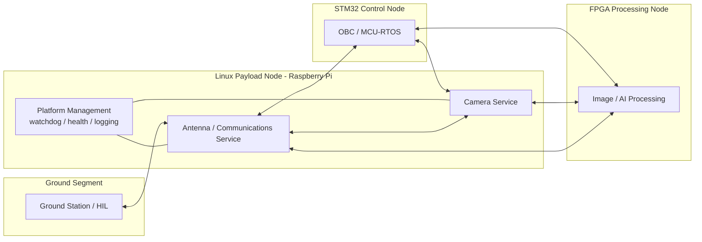

<div style="text-align: center;">
    
</div>

# EXN — Modular Satellite Avionics Demonstration Platform

**EXN** is an ExoSpaceLabs system-integration project for demonstrating a modular Earth-observation avionics and payload architecture across an **STM32 control computer**, an **Embedded Linux payload platform**, an **FPGA processing node**, and a **ground/HIL environment**.

The platform exercises realistic spacecraft engineering boundaries: CCSDS/ECSS packet interfaces, embedded supervision, image acquisition, hardware-accelerated image/AI processing, communications services, telemetry/telecommand workflows, flexible payload-data routing, and end-to-end integration testing.

The detailed logical architecture is defined in [docs/architecture.md](docs/architecture.md). The wire-level packet contract remains [docs/ICD.md](docs/ICD.md).

> [!IMPORTANT]
> EXN is the **system architecture and interface authority**, not a monolithic firmware repository. Logical endpoint responsibilities must remain independent from the physical computer that happens to host them in the current demonstrator.

## System Scope

EXN separates responsibilities across independently testable logical components:

- **STM32 Control Node / OBC:** system supervision, command/telemetry handling, health and fault management, time distribution, configuration, and control-plane routing/orchestration.
- **Linux Payload Node:** Raspberry Pi-based Embedded Linux platform that may host multiple independent payload services.
  - **Camera Service:** image acquisition, payload-product ownership, storage/preparation, compression, and image transfer.
  - **Antenna / Communications Service:** ground-link ingress/egress, TC delivery toward the OBC, payload downlink, and communications-link health.
  - **Platform Management:** Linux watchdog/supervision, service health, logging, storage and system housekeeping.
- **FPGA Processing Node:** hardware-accelerated image preprocessing, inference, postprocessing, and other payload computation. The FPGA is a processing node in EXN, not a communications product.
- **Ground/HIL:** operator tooling, command/telemetry inspection, subsystem simulation, fault injection, and integration validation.

Camera and Antenna/Communications may initially execute on the **same Raspberry Pi 5** while remaining separate logical services. A later deployment may place them on different computers without changing their mission responsibilities.

## Routing Model

EXN distinguishes the **control plane** from the **bulk data plane**.

The nominal flight-like command path is:

```text
Ground -> Antenna/Communications -> STM32 OBC -> selected payload endpoint
```

The current HIL environment may still connect the Ground Station directly to the MCU. That is a deployment profile, not a change of command authority.

Bulk payload data does not need to pass through the MCU. Valid flows include:

```text
Camera -> Antenna -> Ground
Camera -> FPGA -> Camera -> Antenna -> Ground
FPGA -> Antenna -> Ground
FPGA -> OBC
```

The **FPGA result destination is controllable**. A processing result may be routed to the OBC for autonomous decision-making, back to the Camera service for product ownership/storage, to the Antenna service for immediate downlink, to the requesting endpoint, or to multiple consumers when policy requires it.

The exact wire encoding of per-job processing-result routing will be introduced through the corresponding Service 210/interface revision. The architectural requirement is already fixed: the FPGA must not impose one hard-coded result path.

## Repository Role

This repository contains the cross-component architecture, ICDs, diagrams, and shared interface definitions rather than component implementations.

```text
exn/
├── interfaces/             # Shared packet/interface definitions
├── docs/                   # Architecture, ICDs, diagrams, and design notes
├── CHANGELOG.md
├── LICENSE
└── README.md
```

### Component repositories

- **[exn-gs](https://github.com/ExoSpaceLabs/exn-gs):** ground-control and hardware-in-the-loop environment.
- **exn-mcu-rtos:** STM32 control/flight-software component.
- **exn-pi-cam:** Raspberry Pi payload software; currently camera-focused and intended to evolve into the Linux payload-service implementation.
- **exn-fpga-ai:** FPGA image-processing and AI-acceleration component.

### Reusable platform repositories

- **[CCSDSPack](https://github.com/ExoSpaceLabs/CCSDSPack):** CCSDS Space Packet / ECSS PUS packet library.
- **[HardRT](https://github.com/ExoSpaceLabs/hardrt):** RTOS/runtime used for STM32 scheduling, synchronization, timers, signalling and execution control.
- **[DAS](https://github.com/Inczert/device-abstraction-stack):** MCU/device/board abstraction layer, currently targeting STM32H755 / NUCLEO-H755ZI-Q.
- **[SpWKit](https://github.com/ExoSpaceLabs/spwkit):** optional SpaceWire-style transport/simulation toolkit for logical EXN links.

Private/commercial FPGA SpaceWire implementation repositories are **outside EXN scope**. The EXN FPGA node exists for payload image/AI processing. Reusing FPGA hardware for separate SpaceWire development is a different product/integration concern.

## Software and Platform Composition

The reusable libraries are composed by each EXN application; they do not form one ownership chain.

For the STM32 control node, the intended relationship is:

```text
                 exn-mcu-rtos
                      |
        +-------------+-------------+
        |             |             |
    CCSDSPack      HardRT         SpWKit
                                    |
                             transport provider
                                    |
                                   DAS
                                    |
                                STM32H755
```

HardRT and DAS are peers from the application point of view: HardRT owns runtime/scheduling primitives, while DAS owns hardware/device access. SpWKit must not depend directly on DAS; an embedded transport-provider implementation may use DAS below the SpWKit boundary.

## SpWKit and Logical Links

If adopted by an EXN deployment, SpWKit may model multiple independent logical links over a shared physical carrier such as Ethernet.

For example, one Ethernet network may carry logical relationships such as:

```text
Camera <-> OBC
Antenna <-> OBC
Camera <-> FPGA
Camera <-> Antenna
FPGA <-> Antenna
```

This allows the demonstrator to simulate more than one spacecraft link without requiring one physical cable for every logical endpoint pair.

Mission packet/service semantics remain above that transport choice.

## System Graph


```mermaid
graph LR
  subgraph "Ground Segment"
    GS[Ground Station / HIL]
  end

  subgraph "Linux Payload Node - Raspberry Pi"
    CAM[Camera Service]
    ANT[Antenna / Communications Service]
    PM[Platform Management<br/>watchdog / health / logging]
  end

  subgraph "STM32 Control Node"
    OBC[OBC / MCU-RTOS]
  end

  subgraph "FPGA Processing Node"
    FPGA[Image / AI Processing]
  end

  GS <--> ANT
  ANT <--> OBC
  OBC <--> CAM
  OBC <--> FPGA
  CAM <--> FPGA
  CAM <--> ANT
  FPGA <--> ANT
  PM --- CAM
  PM --- ANT
```

The graph shows **allowed logical paths**, not mandatory routing for every operation. The OBC remains the supervisory control point while payload-data routing may bypass it when appropriate.

Additional sequence diagrams are maintained in [docs/diagrams.md](docs/diagrams.md).

## Interfaces and ICDs

- **System architecture:** [docs/architecture.md](docs/architecture.md)
- **Master wire-level ICD:** [docs/ICD.md](docs/ICD.md)
- **Ground/HIL:** [docs/icd/gs.md](docs/icd/gs.md)
- **MCU control node:** [docs/icd/mcu-rtos.md](docs/icd/mcu-rtos.md)
- **Linux payload platform / communications service:** [docs/icd/linux-payload.md](docs/icd/linux-payload.md)
- **Pi camera service:** [docs/icd/pi-cam.md](docs/icd/pi-cam.md)
- **FPGA processing node:** [docs/icd/fpga-ai.md](docs/icd/fpga-ai.md)

### Packet/interface definitions

- CCSDSPack TeleCommands: [interfaces/ccsdspack/tc/](interfaces/ccsdspack/tc/)
- CCSDSPack TeleMetry: [interfaces/ccsdspack/tm/](interfaces/ccsdspack/tm/)
- JSON mirrors for tooling: [interfaces/json/](interfaces/json/)
- MCU header-only definitions: [interfaces/mcu-rtos/](interfaces/mcu-rtos/)

Wire-level changes must remain synchronized with these shared definitions. Architecture changes alone must not silently change packet layouts.

## Integration Direction

The current integration direction is:

1. keep CCSDSPack v2.x as the packet/interface baseline;
2. bring the MCU application up on HardRT + DAS against the central EXN ICD;
3. evolve the Pi from a camera-only implementation into the supervised Linux payload-service platform;
4. keep the FPGA focused on image/AI processing and make processing-result routing configurable;
5. use direct payload-data paths where they reduce unnecessary MCU traffic;
6. adopt SpWKit only where its logical-link/transport model improves EXN integration, and validate that integration explicitly;
7. restore complete node-to-node HIL/system regression before freezing an EXN system release.

## License

Apache License 2.0. See [LICENSE](LICENSE) for the authoritative terms.
