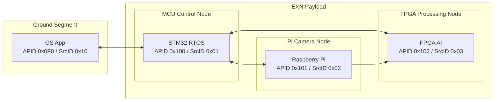

<div style="text-align: center;">
    
</div>

# EXN — Modular Satellite Avionics Demonstration Platform

**EXN** is an ExoSpaceLabs system-integration project for demonstrating a modular Earth-observation payload architecture across a **Raspberry Pi payload computer**, **STM32 control node**, **FPGA processing node**, and **ground/HIL environment**.

The platform is intended to exercise realistic spacecraft engineering boundaries: CCSDS/ECSS packet interfaces, embedded supervision, image acquisition and processing, FPGA acceleration, telemetry/telecommand workflows, and end-to-end integration testing. SpaceWire integration is a planned transport direction and should be treated separately from interfaces that are already implemented.

> [!IMPORTANT]
> **Modernization status — 2026-08-31:** the architecture and ICD remain the project direction, but the implementation/dependency baseline is being refreshed. Existing component integration should be treated as transitional until the stack is migrated to **CCSDSPack 2.x**, with clean-checkout CI and HIL regression restored. Adoption of **SpWKit** as the EXN SpaceWire transport layer is tracked as a separate integration decision rather than assumed to exist today. Progress is tracked in [issue #2](https://github.com/ExoSpaceLabs/exn/issues/2).

## System Scope

EXN separates payload responsibilities across independent computing nodes:

- **Pi Camera Node:** image acquisition, payload-data preparation, thumbnail/event generation, and host-side payload processing.
- **STM32 Control Node:** system supervision, command/telemetry handling, health monitoring, configuration, and routing/orchestration.
- **FPGA Processing Node:** deterministic data movement plus hardware-accelerated preprocessing/inference/postprocessing functions.
- **Ground/HIL:** operator tooling, command/telemetry inspection, subsystem simulation, fault injection, and integration validation.
- **CCSDSPack:** CCSDS Space Packet and ECSS PUS packet contract used across software nodes.
- **SpWKit:** candidate SpaceWire transport/simulation layer for future EXN transport integration; it is not currently a required EXN dependency.

The objective is not to force every function onto one device. Each component should remain independently testable and replaceable behind documented packet, transport, and hardware interfaces.

## Repository Role

This repository is the **architecture and interface authority** for EXN. It contains the cross-component documentation and shared interface definitions rather than the component implementations themselves.

```text
exn/
├── interfaces/             # Shared packet/interface definitions
├── docs/                   # Architecture, ICDs, diagrams, and design notes
├── CHANGELOG.md
├── LICENSE
└── README.md
```

### Component repositories

- **[exn-gs](https://github.com/ExoSpaceLabs/exn-gs):** ground-control and hardware-in-the-loop environment.
- **exn-mcu-rtos:** STM32 control/flight-software component.
- **exn-pi-cam:** Raspberry Pi camera and payload-processing component.
- **exn-fpga-ai:** FPGA payload bridge and acceleration component.
- **[CCSDSPack](https://github.com/ExoSpaceLabs/CCSDSPack):** CCSDS/PUS packet library.
- **[SpWKit](https://github.com/ExoSpaceLabs/spwkit):** candidate SpaceWire transport toolkit for future EXN integration.

## Dependency Baseline

The mandatory modernization path is:

`CCSDSPack 2.0.0` → `EXN packet/interface migration` → `EXN system baseline`

SpWKit has its own CCSDSPack 2.x interoperability work. If EXN adopts SpWKit for SpaceWire transport, that integration must be added and validated explicitly rather than folded implicitly into the packet migration.

A new EXN release baseline should only be cut once:

1. CCSDSPack 2.x is available as a released package/API contract.
2. Existing EXN CCSDS/PUS consumers and shared definitions have been migrated to that contract.
3. All EXN software components build from clean checkouts without developer-local dependency paths.
4. Shared CCSDS/PUS interfaces are validated across component boundaries.
5. End-to-end simulation/HIL regressions pass against the documented dependency matrix.
6. Any SpaceWire/SpWKit support claimed by EXN has its own implementation and integration evidence.

## System Graph


```mermaid
graph LR
  subgraph "Ground Segment"
    direction TB
    GSNode[GS App<br/>APID 0x0F0 / SrcID 0x10]
  end

  subgraph "EXN Payload"
    direction TB

    subgraph "MCU Control Node"
      MCUNode[STM32 RTOS<br/>APID 0x100 / SrcID 0x01]
    end

    subgraph "Pi Camera Node"
      PiNode[Raspberry Pi<br/>APID 0x101 / SrcID 0x02]
    end

    subgraph "FPGA Processing Node"
      FpgaNode[FPGA AI<br/>APID 0x102 / SrcID 0x03]
    end
  end

  GSNode <--> MCUNode
  MCUNode <--> PiNode
  MCUNode <--> FpgaNode
  PiNode --> FpgaNode
```

The MCU is the supervisory control point for payload coordination. Devices remain independently testable and should not depend on the ground segment for their internal operation.

Additional sequence diagrams are maintained in [docs/diagrams.md](docs/diagrams.md).

## Interfaces and ICD

The shared interface definitions are the primary integration contract between repositories.

- **Master ICD:** [docs/ICD.md](docs/ICD.md)
- **Ground/HIL:** [docs/icd/gs.md](docs/icd/gs.md)
- **MCU control node:** [docs/icd/mcu-rtos.md](docs/icd/mcu-rtos.md)
- **Pi camera node:** [docs/icd/pi-cam.md](docs/icd/pi-cam.md)
- **FPGA processing node:** [docs/icd/fpga-ai.md](docs/icd/fpga-ai.md)

### Packet/interface definitions

- CCSDSPack TeleCommands: [interfaces/ccsdspack/tc/](interfaces/ccsdspack/tc/)
- CCSDSPack TeleMetry: [interfaces/ccsdspack/tm/](interfaces/ccsdspack/tm/)
- JSON mirrors for tooling: [interfaces/json/](interfaces/json/)
- MCU header-only definitions: [interfaces/mcu-rtos/](interfaces/mcu-rtos/)

These definitions must be reconciled with the CCSDSPack 2.x API/profile during modernization rather than assumed to remain wire-compatible automatically.

## Modernization Roadmap

### Phase 0 — Dependency and interface reset

- Publish CCSDSPack 2.0.0.
- Define the supported EXN CCSDSPack version and canonical CMake package target.
- Reconcile the central ICD and packet definitions with the released packet API.
- Decide whether SpWKit becomes the supported EXN SpaceWire layer and define that integration as separate scope if adopted.

### Phase 1 — Ground/HIL migration

- Migrate EXN-GS to versioned CCSDSPack package discovery.
- Restore clean-checkout CI.
- Validate CCSDS/PUS encoding/decoding and the currently implemented Serial/TCP simulator paths.

### Phase 2 — Flight/payload component migration

- Migrate MCU control software to the refreshed packet/interface contract.
- Migrate Pi payload/camera telemetry and payload-data interfaces.
- Migrate FPGA transport/container interfaces.

### Phase 3 — System integration

- Restore node-to-node regression tests.
- Execute representative command, housekeeping, payload-data, and fault scenarios.
- Validate end-to-end HIL/simulation operation against the documented dependency baseline.
- Add SpaceWire/SpWKit integration tests only if that transport is implemented as part of EXN.

### Phase 4 — Coherent EXN release baseline

- Freeze the compatible component revisions.
- Update architecture/ICD documentation from validated behavior.
- Tag and publish the first post-modernization EXN system baseline.

## License

Apache License 2.0. See [LICENSE](LICENSE) for the authoritative terms.
