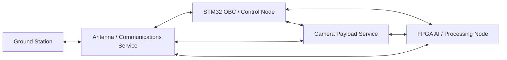
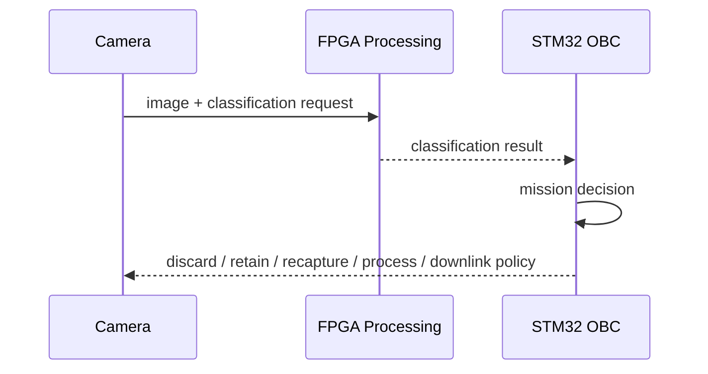
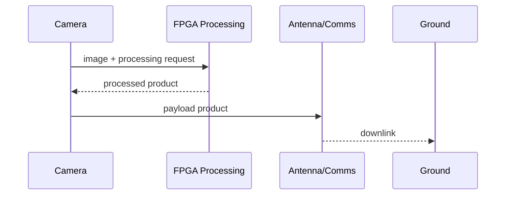
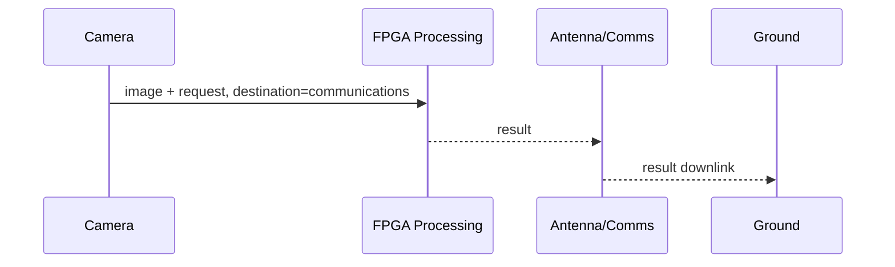

# EXN System Architecture

This document defines the logical EXN system architecture and the ownership boundaries between the control computer, Linux payload services, FPGA processing, ground communications, and reusable platform libraries.

The master wire-level contract remains [`docs/ICD.md`](ICD.md). This document describes how EXN components are intended to be composed and how control/data may flow between them without forcing one fixed mission pipeline.

## 1. Architectural principles

EXN is a modular avionics and payload demonstrator. The architecture intentionally separates **logical spacecraft endpoints** from the **physical computers** that currently host them.

The main rules are:

1. **STM32 is the spacecraft control authority.** It owns supervision, command orchestration, health/fault handling, time distribution, and control-plane routing.
2. **The Raspberry Pi is an Embedded Linux Payload Platform.** It may host multiple independent services, initially Camera and Antenna/Communications, without making those services one monolithic application.
3. **The FPGA is a processing node.** Its EXN role is image preprocessing, inference, postprocessing, and other hardware-accelerated payload computation.
4. **Processing results do not have one fixed destination.** The requester or mission policy selects where a result is delivered.
5. **Bulk payload data need not transit the MCU.** Control traffic should remain MCU-centric, while high-volume data paths may connect payload endpoints directly.
6. **Transport is below mission semantics.** Packet/service behavior must not depend on whether the current carrier is Ethernet, a simulated SpaceWire link, local Linux IPC, or a future physical transport.
7. **Reusable libraries remain independent projects.** EXN consumes CCSDSPack, HardRT, DAS, and optionally SpWKit. Their internal implementation scope is not part of the EXN mission architecture.

## 2. Logical system



The arrows above represent **permitted logical paths**, not a requirement that every deployment instantiate every path or transport.

The control architecture remains centered on the OBC, but the data plane is intentionally more flexible.

## 3. Physical deployment

The initial intended deployment is:

```text
Ground Station
      |
      | RF / Wi-Fi / network link as deployed
      v
+------------------------------------------------+
| Raspberry Pi 5 - Embedded Linux Payload Node   |
|                                                |
|  Camera Service       Antenna/Comms Service    |
|        |                        |               |
|        +------ platform services -------------+|
|               watchdog / health / logging      |
+----------------------+-------------------------+
                       |
                 Ethernet / other carrier
              +--------+---------+
              |                  |
              v                  v
       STM32 Control Node     FPGA Processing Node
       HardRT + DAS           Image/AI acceleration
```

Camera and Antenna/Communications are therefore **independent logical services even when they execute on the same Raspberry Pi**. A later deployment may move either service to a different Linux computer without changing its mission responsibility.

## 4. Linux payload platform

The Raspberry Pi should be treated as a supervised Linux service platform rather than as one camera executable.

A representative service layout is:

```text
Linux
 |
 +-- exn-camera.service
 +-- exn-antenna.service
 +-- exn-platform.service
 +-- system watchdog
 +-- journald / telemetry collection
 +-- persistent payload storage
```

### 4.1 Camera service

Responsibilities include:

- sensor acquisition;
- image metadata and product ownership;
- capture configuration;
- local buffering/storage;
- compression or host-side preparation;
- transfer to FPGA for processing;
- reception/association of processed products;
- direct handoff to the communications service when appropriate.

The Camera service remains the natural owner of captured payload products even when computation is delegated to FPGA.

### 4.2 Antenna / Communications service

Responsibilities include:

- ground-facing RF/network link handling;
- uplink ingress and downlink egress;
- delivery of ground TCs toward the OBC control path;
- direct transmission of payload data when mission policy permits it;
- communications-link health and status reporting.

The communications service is **not** the spacecraft command authority. Ground commands normally enter through it and are delivered to the OBC for control-plane handling.

### 4.3 Platform service

The Linux platform-management layer should provide or aggregate:

- hardware/system watchdog integration;
- service restart/supervision state;
- CPU load and temperature;
- memory and storage state;
- process/service health;
- network/link state;
- restart/error counters;
- uptime and system-level events.

`systemd` may provide process supervision and watchdog integration, while mission-facing health is reported through EXN housekeeping/event services.

## 5. Control plane and data plane

EXN deliberately distinguishes the control plane from the bulk data plane.

### 5.1 Control plane

The nominal flight-like command path is:

```text
Ground
  -> Antenna/Communications Service
  -> STM32 OBC
  -> selected payload endpoint
```

For example:

```text
Ground -> Antenna -> OBC -> Camera
Ground -> Antenna -> OBC -> FPGA
```

The existing HIL/ground implementation may still connect GS directly to the MCU. That is a deployment profile, not a change in control ownership.

### 5.2 Data plane

Payload data may bypass the MCU when no control decision requires the MCU to carry the bytes themselves.

Valid examples include:

```text
Camera -> Antenna -> Ground
Camera -> FPGA -> Camera -> Antenna -> Ground
FPGA -> Antenna -> Ground
```

The OBC can still receive metadata, classification results, status, or selected products required for autonomous decisions.

## 6. FPGA processing and result routing

The FPGA is a **processing service**, not a fixed stage in a hard-coded `Camera -> FPGA -> Camera` pipeline.

A processing request conceptually contains:

```text
job identifier
processing/pipeline identifier
input reference or input stream
processing parameters
result destination(s)
delivery policy
```

The exact wire encoding of the routing fields is intentionally left to the Service 210/interface revision that implements this architecture. The architectural requirement is already fixed: **result routing must be controllable per processing request or by an explicitly configured mission policy.**

### 6.1 Typical destinations

A processing result may be routed to one or more of:

- **OBC**, for autonomous decisions, event generation, or subsequent commanding;
- **Camera service**, to associate the result with the source image, store it, or generate another payload product;
- **Antenna/Communications service**, for immediate downlink;
- **Ground**, when a communications path is established and policy allows direct delivery;
- **requesting endpoint**, for request/response-style processing;
- **multiple endpoints**, when both control and payload consumers need the result.

### 6.2 Example: autonomous classification



A classification can therefore influence spacecraft behavior without requiring a full processed image to return through the MCU.

### 6.3 Example: processed payload product



### 6.4 Example: direct result downlink



Direct downlink is conditional on link availability and mission policy. Loss of the ground link must not make FPGA execution semantics depend on the ground station being present.

## 7. SpWKit in EXN

SpWKit may be used as a logical SpaceWire-style interconnect and simulation layer between EXN endpoints.

A useful deployment can expose several independent logical links over one real Ethernet carrier, for example:

```text
Physical Ethernet
      |
      +-- Camera <-> OBC
      +-- Antenna <-> OBC
      +-- Camera <-> FPGA
      +-- Camera <-> Antenna
      +-- FPGA <-> Antenna
```

This lets EXN model multiple spacecraft communication relationships without requiring one physical cable per logical link.

SpWKit remains a reusable independent project. EXN should consume only the public transport/link behavior that it needs. **Commercial/private FPGA SpaceWire implementation repositories are outside EXN scope.** The EXN FPGA node is defined by its payload-processing role, not by any separate SpaceWire FPGA product.

On STM32, any future SpWKit-over-Ethernet binding should preserve the library boundaries:

```text
EXN application
      |
   SpWKit
      |
transport-provider boundary
      |
     DAS
      |
STM32 Ethernet hardware
```

SpWKit must not require DAS directly, and DAS must not know about SpWKit. HardRT provides scheduling, synchronization, timing, IRQ-to-task signalling, and timeout/retry execution around the application and transport integration.

## 8. Reusable software stack

```text
EXN mission applications / services
      |
      +-- CCSDSPack      CCSDS/PUS packet model
      +-- SpWKit         optional logical SpaceWire/interconnect layer
      +-- HardRT         STM32 RTOS/synchronization/runtime
      +-- DAS            MCU/device/board abstraction
```

The dependencies are composed by the EXN component application. They are not one vertical framework that owns the layer below it.

For the STM32 control node in particular:

```text
                 exn-mcu-rtos
                      |
        +-------------+-------------+
        |             |             |
    CCSDSPack      HardRT         SpWKit
                                    |
                             transport provider
                                    |
                                   DAS
                                    |
                                STM32H755
```

## 9. Interface ownership

The documentation boundary is:

- **`docs/architecture.md`**: logical nodes, responsibilities, control/data paths, routing policy, and reusable-stack composition;
- **`docs/ICD.md`**: exact CCSDS/PUS wire contract and routing fields;
- **`docs/icd/`**: endpoint-specific service behavior and payload layouts;
- **component repositories**: implementation details;
- **CCSDSPack / HardRT / DAS / SpWKit repositories**: reusable library APIs and implementation-specific qualification.

This separation allows EXN to change deployment topology without rewriting mission semantics and allows reusable libraries to evolve without becoming EXN-specific.