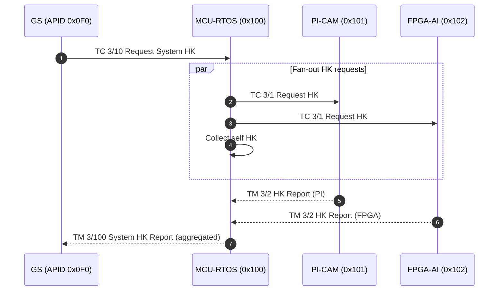
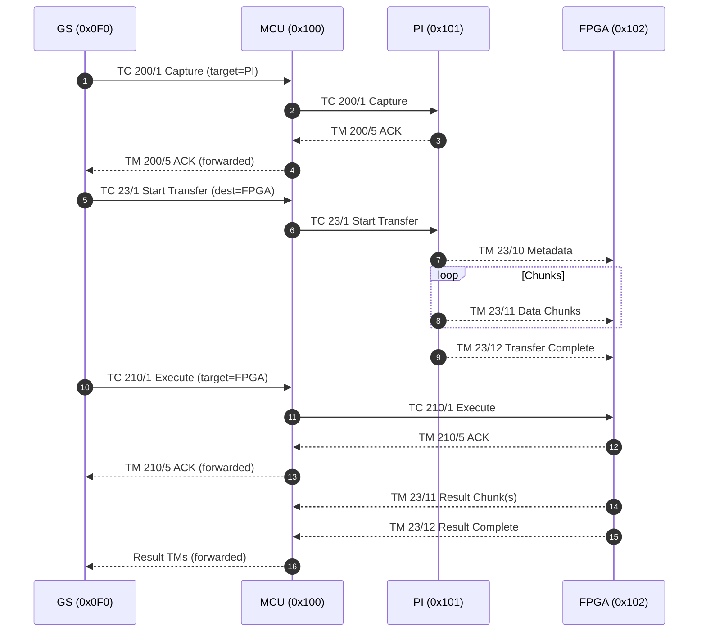

# EXN — Sequence Diagrams

This page collects the rendered Mermaid sequence diagrams referenced by the root README. They illustrate key interactions among Ground Station (GS), MCU-RTOS (MCU), PI-CAM (PI), and FPGA-AI (FPGA).

Notes for GitHub rendering:
- Mermaid blocks use conservative, GitHub-friendly syntax.
- Subgraph quotations are not required for sequence diagrams, but labels are kept simple.

---

## 1) System Housekeeping Aggregation

GS requests a System HK from MCU. MCU fans out HK requests to devices, aggregates their HK, and returns a single System HK report.

---

## 2) Capture → Transfer → Execute → Result

A GS-driven end-to-end scenario: capture on PI, transfer to FPGA, execute inference, and receive results via MCU.

