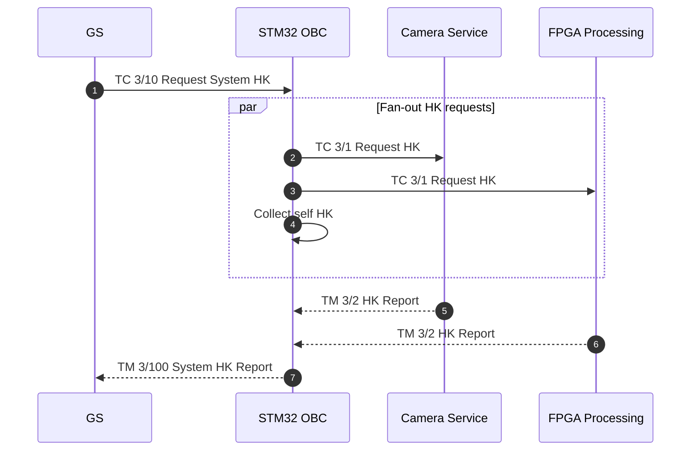
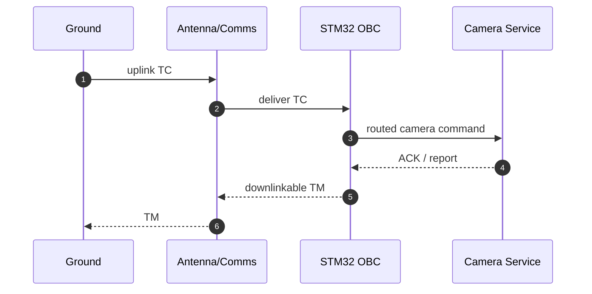
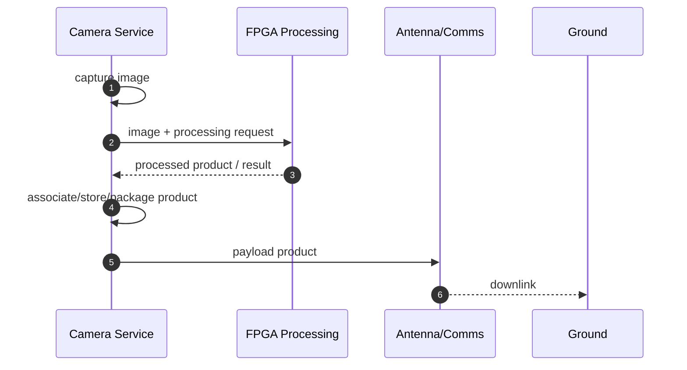
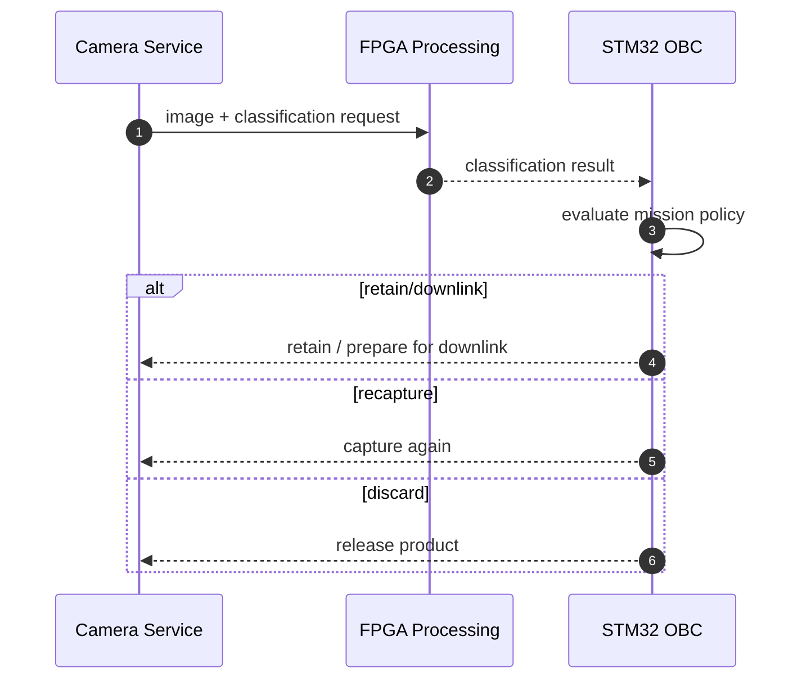
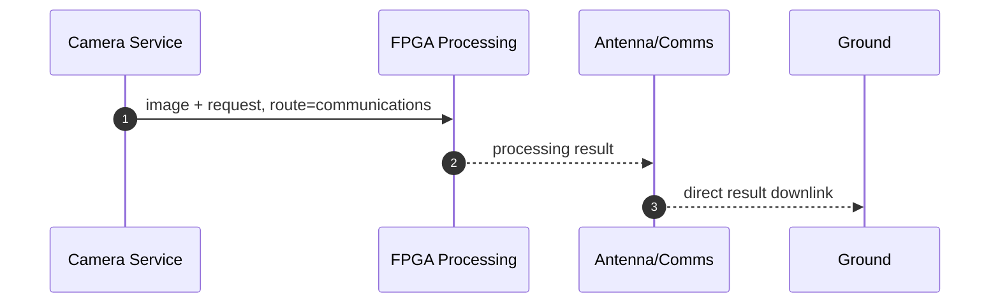
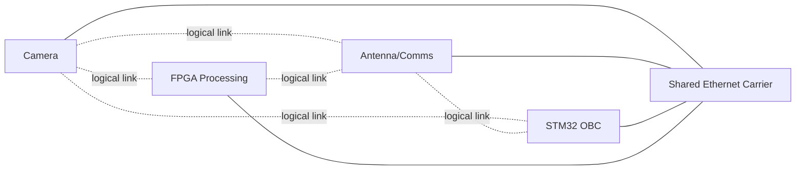

# EXN — Sequence Diagrams

This page collects representative EXN interactions among Ground Station (GS), STM32/OBC, Linux payload services, and FPGA processing.

The diagrams show **valid flows**, not one mandatory pipeline. EXN separates control authority from payload-data routing, and FPGA processing results may be routed differently depending on the request and mission policy.

---

## 1) System Housekeeping Aggregation

The existing HIL profile may connect GS directly to MCU/OBC. The MCU fans out HK requests, aggregates the reports, and returns System HK.

```mermaid
sequenceDiagram
  autonumber
  participant GS as GS
  participant MCU as STM32 OBC
  participant CAM as Camera Service
  participant FPGA as FPGA Processing

  GS->>MCU: TC 3/10 Request System HK
  par Fan-out HK requests
    MCU->>CAM: TC 3/1 Request HK
    MCU->>FPGA: TC 3/1 Request HK
    MCU->>MCU: Collect self HK
  end
  CAM-->>MCU: TM 3/2 HK Report
  FPGA-->>MCU: TM 3/2 HK Report
  MCU-->>GS: TM 3/100 System HK Report
```

A flight-like deployment may place the Antenna/Communications service between GS and MCU without changing MCU control ownership.

---

## 2) Flight-like Ground Command Path

Ground traffic enters through the communications service, while the OBC remains the command authority.

```mermaid
sequenceDiagram
  autonumber
  participant GS as Ground
  participant ANT as Antenna/Comms
  participant MCU as STM32 OBC
  participant CAM as Camera Service

  GS->>ANT: uplink TC
  ANT->>MCU: deliver TC
  MCU->>CAM: routed camera command
  CAM-->>MCU: ACK / report
  MCU-->>ANT: downlinkable TM
  ANT-->>GS: TM
```

---

## 3) Capture -> FPGA Processing -> Camera Product -> Ground

The Camera service owns the payload product and delegates computation to FPGA.

```mermaid
sequenceDiagram
  autonumber
  participant CAM as Camera Service
  participant FPGA as FPGA Processing
  participant ANT as Antenna/Comms
  participant GS as Ground

  CAM->>CAM: capture image
  CAM->>FPGA: image + processing request
  FPGA-->>CAM: processed product / result
  CAM->>CAM: associate/store/package product
  CAM->>ANT: payload product
  ANT-->>GS: downlink
```

---

## 4) Classification Result Routed to OBC

A low-volume inference result may be sent directly to the OBC so software can make an autonomous mission decision.

```mermaid
sequenceDiagram
  autonumber
  participant CAM as Camera Service
  participant FPGA as FPGA Processing
  participant MCU as STM32 OBC

  CAM->>FPGA: image + classification request
  FPGA-->>MCU: classification result
  MCU->>MCU: evaluate mission policy
  alt retain/downlink
    MCU-->>CAM: retain / prepare for downlink
  else recapture
    MCU-->>CAM: capture again
  else discard
    MCU-->>CAM: release product
  end
```

---

## 5) Direct FPGA Result Downlink

When a ground link exists and policy permits it, a processing result may bypass the OBC data path.

```mermaid
sequenceDiagram
  autonumber
  participant CAM as Camera Service
  participant FPGA as FPGA Processing
  participant ANT as Antenna/Comms
  participant GS as Ground

  CAM->>FPGA: image + request, route=communications
  FPGA-->>ANT: processing result
  ANT-->>GS: direct result downlink
```

The OBC may still receive separate status, metadata, or decision-relevant information. Direct data routing does not transfer command authority away from the OBC.

---

## 6) Logical Links over Shared Ethernet

SpWKit may represent multiple logical relationships over one physical Ethernet carrier.

```mermaid
graph LR
  ETH[Shared Ethernet Carrier]
  CAM[Camera]
  ANT[Antenna/Comms]
  MCU[STM32 OBC]
  FPGA[FPGA Processing]

  CAM --- ETH
  ANT --- ETH
  MCU --- ETH
  FPGA --- ETH

  CAM -. logical link .- MCU
  ANT -. logical link .- MCU
  CAM -. logical link .- FPGA
  CAM -. logical link .- ANT
  FPGA -. logical link .- ANT
```

The logical routes are independent of whether Camera and Antenna currently execute on the same Raspberry Pi.